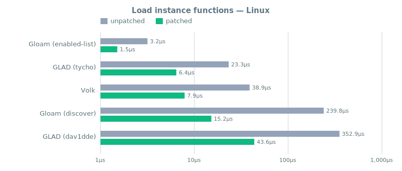
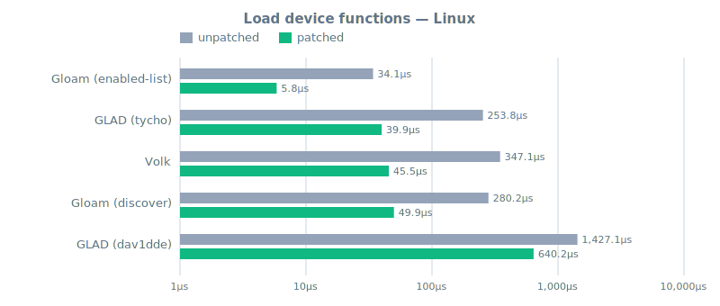
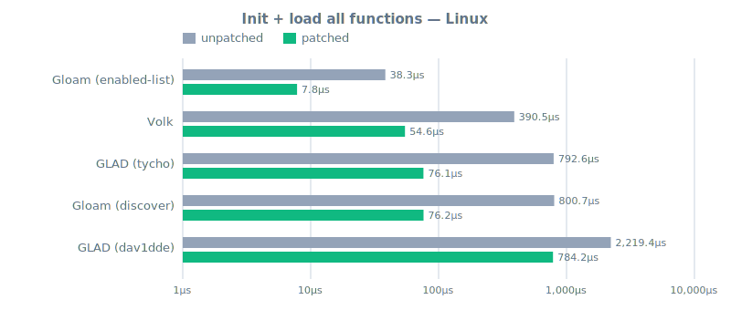
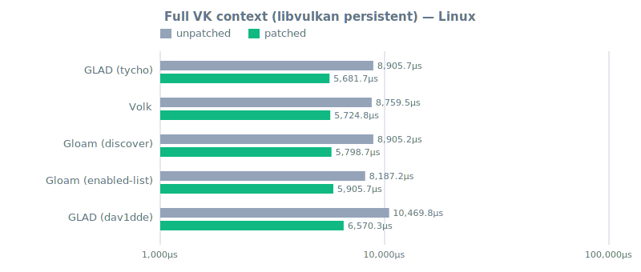
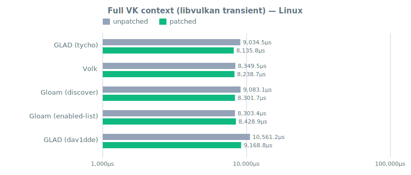

# Linux report

_This file is generated by `make render` from `reports/linux/*.json`.
Do not edit by hand - edits will be overwritten on the next render._

> **How to read this.** These numbers measure function-pointer loading overhead
> and Vulkan context setup across different API loaders, comparing the stock
> Vulkan loader against the patched one (see the README for what the patch
> does). **Lower is better.**
>
> **Do not compare across hosts.** Hardware, drivers, OS, and compiler flags
> all differ between the Linux, MinGW, and macOS reports. The meaningful
> comparisons are *within* a single report: loader vs. loader and patched vs.
> unpatched on the same hardware.


## At a glance

Lower is better. **Winner** = best patched average on this host for each task.

| Task                                   | Winner                   | Patched avg | Unpatched avg | Patch speedup |
|----------------------------------------|--------------------------|------------:|--------------:|--------------:|
| Load instance functions                | **Gloam (enabled-list)** |      1.51µs |        3.17µs |          2.1× |
| Load device functions                  | **Gloam (enabled-list)** |      5.85µs |       34.07µs |          5.8× |
| Init + load all functions              | **Gloam (enabled-list)** |      7.83µs |       38.33µs |          4.9× |
| Full VK context (libvulkan persistent) | **GLAD (tycho)**         |   5681.70µs |     8905.70µs |          1.6× |
| Full VK context (libvulkan transient)  | **GLAD (tycho)**         |   8135.77µs |     9034.50µs |          1.1× |


## Task detail

### Load instance functions

| Loader                   | Unpatched | Patched | Patch speedup | vs. fastest |
|--------------------------|----------:|--------:|--------------:|------------:|
| **Gloam (enabled-list)** |    3.17µs |  1.51µs |          2.1× |        1.0× |
| GLAD (tycho)             |   23.27µs |  6.43µs |          3.6× |        4.3× |
| Volk                     |   38.87µs |  7.88µs |          4.9× |        5.2× |
| Gloam (discover)         |  239.85µs | 15.20µs |         15.8× |       10.1× |
| GLAD (dav1dde)           |  352.94µs | 43.57µs |          8.1× |       28.9× |




### Load device functions

| Loader                   | Unpatched |  Patched | Patch speedup | vs. fastest |
|--------------------------|----------:|---------:|--------------:|------------:|
| **Gloam (enabled-list)** |   34.07µs |   5.85µs |          5.8× |        1.0× |
| GLAD (tycho)             |  253.82µs |  39.85µs |          6.4× |        6.8× |
| Volk                     |  347.14µs |  45.47µs |          7.6× |        7.8× |
| Gloam (discover)         |  280.25µs |  49.87µs |          5.6× |        8.5× |
| GLAD (dav1dde)           | 1427.07µs | 640.17µs |          2.2× |        109× |




### Init + load all functions

| Loader                   | Unpatched |  Patched | Patch speedup | vs. fastest |
|--------------------------|----------:|---------:|--------------:|------------:|
| **Gloam (enabled-list)** |   38.33µs |   7.83µs |          4.9× |        1.0× |
| Volk                     |  390.50µs |  54.63µs |          7.1× |        7.0× |
| GLAD (tycho)             |  792.57µs |  76.13µs |         10.4× |        9.7× |
| Gloam (discover)         |  800.73µs |  76.20µs |         10.5× |        9.7× |
| GLAD (dav1dde)           | 2219.37µs | 784.20µs |          2.8× |        100× |




### Full VK context (libvulkan persistent)

| Loader               |  Unpatched |   Patched | Patch speedup | vs. fastest |
|----------------------|-----------:|----------:|--------------:|------------:|
| **GLAD (tycho)**     |  8905.70µs | 5681.70µs |          1.6× |        1.0× |
| Volk                 |  8759.50µs | 5724.77µs |          1.5× |        1.0× |
| Gloam (discover)     |  8905.17µs | 5798.67µs |          1.5× |        1.0× |
| Gloam (enabled-list) |  8187.17µs | 5905.70µs |          1.4× |        1.0× |
| GLAD (dav1dde)       | 10469.83µs | 6570.27µs |          1.6× |        1.2× |




### Full VK context (libvulkan transient)

| Loader               |  Unpatched |   Patched | Patch speedup | vs. fastest |
|----------------------|-----------:|----------:|--------------:|------------:|
| **GLAD (tycho)**     |  9034.50µs | 8135.77µs |          1.1× |        1.0× |
| Volk                 |  8349.53µs | 8238.67µs |          1.0× |        1.0× |
| Gloam (discover)     |  9083.13µs | 8301.73µs |          1.1× |        1.0× |
| Gloam (enabled-list) |  8303.40µs | 8428.87µs |          1.0× |        1.0× |
| GLAD (dav1dde)       | 10561.17µs | 9168.83µs |          1.2× |        1.1× |




## Binary sizes

All sizes in bytes. Sorted by stripped binary size. Section values come from `size`; Mach-O binaries report BSS as zero because the Mach-O segment model folds zero-init into `__DATA`.

| Loader               | Loader .o |  Binary |    text |  data |   bss |
|----------------------|----------:|--------:|--------:|------:|------:|
| Gloam (discover)     |    50,992 |  59,824 |  54,005 |   864 | 7,136 |
| Gloam (enabled-list) |    50,992 |  59,832 |  54,789 |   872 | 7,144 |
| GLAD (tycho)         |    67,192 |  80,320 |  66,623 | 7,400 | 7,072 |
| Volk                 |   315,096 | 100,696 |  94,069 |   832 | 6,112 |
| GLAD (dav1dde)       |   316,288 | 113,016 | 103,870 |   864 | 6,600 |


<details>
<summary>Test host details</summary>

### Host

| Field        | Value                                     |
|--------------|-------------------------------------------|
| OS           | Linux 6.19.12-1-hsw                       |
| Architecture | x86_64                                    |
| CPU          | AMD RYZEN AI MAX+ PRO 395 w/ Radeon 8060S |


### Toolchain

| Field    | Value                                                      |
|----------|------------------------------------------------------------|
| CC       | clang (22.1.1)                                             |
| CXX      | clang++ (22.1.1)                                           |
| OPTFLAGS | `-O2 -fno-unroll-loops -march=x86-64-v2 -mtune=znver3 -g0` |
| CFLAGS   | `-std=c17`                                                 |
| CXXFLAGS | `-std=c++20`                                               |


### Project versions

| Project        | Version                 |
|----------------|-------------------------|
| GLAD (dav1dde) | `2.0.8-8-ga4ca574`      |
| GLAD (tycho)   | `2.0.8-91-g8092eae`     |
| gloam          | `0.4.8-1-gac4fa45`      |
| Volk           | `1.4.341.0-26-gd41d1af` |
| xxHash         | `0.7.4-1019-ge573d4d`   |
| Vulkan-Headers | `1.4.349`               |


### vulkaninfo

```
Devices:
========
GPU0:
	apiVersion         = 1.4.348
	driverVersion      = 26.0.99
	vendorID           = 0x1002
	deviceID           = 0x1586
	deviceType         = PHYSICAL_DEVICE_TYPE_INTEGRATED_GPU
	deviceName         = Radeon 8060S Graphics (RADV STRIX_HALO)
	driverID           = DRIVER_ID_MESA_RADV
	driverName         = radv
	driverInfo         = Mesa 26.1.0-devel (git-3a076beb13)
	conformanceVersion = 1.4.0.0
	deviceUUID         = 00000000-c300-0000-0000-000000000000
	driverUUID         = 414d442d-4d45-5341-2d44-525600000000
```

</details>
