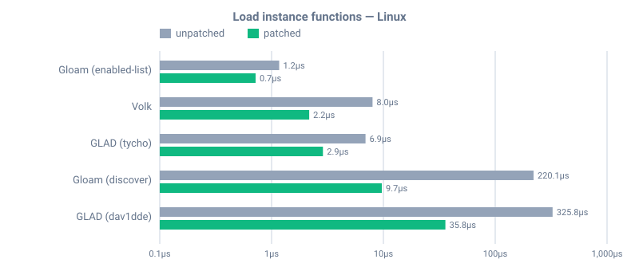
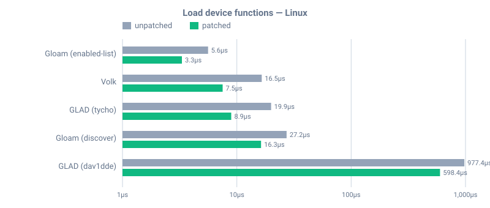
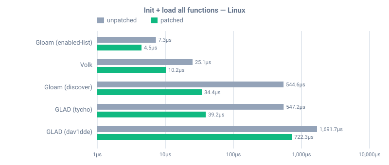
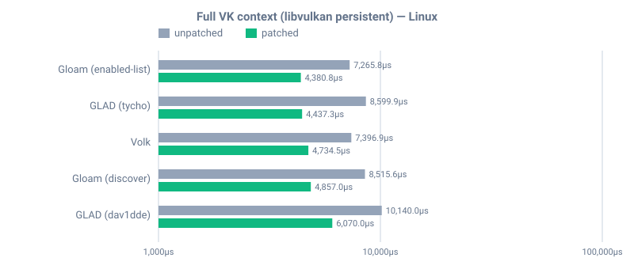
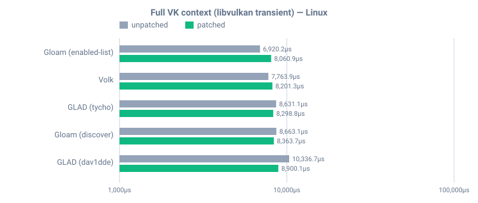

# Linux report

_This file is generated by `make render` from `reports/linux/*.json`.
Do not edit by hand - edits will be overwritten on the next render._

> **How to read this.** These numbers measure function-pointer loading overhead
> and Vulkan context setup across different API loaders, comparing the stock
> Vulkan loader against the patched one (see the README for what the patch
> does). **Lower is better.**
>
> **Do not compare across hosts.** Hardware, drivers, OS, and compiler flags
> all differ between the Linux, MinGW, and macOS reports. The meaningful
> comparisons are *within* a single report: loader vs. loader and patched vs.
> unpatched on the same hardware.


## At a glance

Lower is better. **Winner** = best patched average on this host for each task.

| Task                                   | Winner                   | Patched avg | Unpatched avg | Patch speedup |
|----------------------------------------|--------------------------|------------:|--------------:|--------------:|
| Load instance functions                | **Gloam (enabled-list)** |      0.72µs |        1.17µs |          1.6× |
| Load device functions                  | **Gloam (enabled-list)** |      3.31µs |        5.60µs |          1.7× |
| Init + load all functions              | **Gloam (enabled-list)** |      4.47µs |        7.27µs |          1.6× |
| Full VK context (libvulkan persistent) | **Gloam (enabled-list)** |   4380.83µs |     7265.83µs |          1.7× |
| Full VK context (libvulkan transient)  | **Gloam (enabled-list)** |   8060.87µs |     6920.23µs |          0.9× |


## Task detail

### Load instance functions

| Loader                   | Unpatched | Patched | Patch speedup | vs. fastest |
|--------------------------|----------:|--------:|--------------:|------------:|
| **Gloam (enabled-list)** |    1.17µs |  0.72µs |          1.6× |        1.0× |
| Volk                     |    7.99µs |  2.17µs |          3.7× |        3.0× |
| GLAD (tycho)             |    6.92µs |  2.88µs |          2.4× |        4.0× |
| Gloam (discover)         |  220.13µs |  9.68µs |         22.7× |       13.4× |
| GLAD (dav1dde)           |  325.82µs | 35.84µs |          9.1× |       49.8× |




### Load device functions

| Loader                   | Unpatched |  Patched | Patch speedup | vs. fastest |
|--------------------------|----------:|---------:|--------------:|------------:|
| **Gloam (enabled-list)** |    5.60µs |   3.31µs |          1.7× |        1.0× |
| Volk                     |   16.50µs |   7.51µs |          2.2× |        2.3× |
| GLAD (tycho)             |   19.94µs |   8.93µs |          2.2× |        2.7× |
| Gloam (discover)         |   27.23µs |  16.28µs |          1.7× |        4.9× |
| GLAD (dav1dde)           |  977.43µs | 598.40µs |          1.6× |        181× |




### Init + load all functions

| Loader                   | Unpatched |  Patched | Patch speedup | vs. fastest |
|--------------------------|----------:|---------:|--------------:|------------:|
| **Gloam (enabled-list)** |    7.27µs |   4.47µs |          1.6× |        1.0× |
| Volk                     |   25.10µs |  10.17µs |          2.5× |        2.3× |
| Gloam (discover)         |  544.60µs |  34.40µs |         15.8× |        7.7× |
| GLAD (tycho)             |  547.17µs |  39.23µs |         13.9× |        8.8× |
| GLAD (dav1dde)           | 1691.70µs | 722.27µs |          2.3× |        162× |




### Full VK context (libvulkan persistent)

| Loader                   |  Unpatched |   Patched | Patch speedup | vs. fastest |
|--------------------------|-----------:|----------:|--------------:|------------:|
| **Gloam (enabled-list)** |  7265.83µs | 4380.83µs |          1.7× |        1.0× |
| GLAD (tycho)             |  8599.87µs | 4437.27µs |          1.9× |        1.0× |
| Volk                     |  7396.93µs | 4734.47µs |          1.6× |        1.1× |
| Gloam (discover)         |  8515.60µs | 4857.00µs |          1.8× |        1.1× |
| GLAD (dav1dde)           | 10139.97µs | 6069.97µs |          1.7× |        1.4× |




### Full VK context (libvulkan transient)

| Loader                   |  Unpatched |   Patched | Patch speedup | vs. fastest |
|--------------------------|-----------:|----------:|--------------:|------------:|
| **Gloam (enabled-list)** |  6920.23µs | 8060.87µs |          0.9× |        1.0× |
| Volk                     |  7763.93µs | 8201.30µs |          0.9× |        1.0× |
| GLAD (tycho)             |  8631.13µs | 8298.83µs |          1.0× |        1.0× |
| Gloam (discover)         |  8663.10µs | 8363.73µs |          1.0× |        1.0× |
| GLAD (dav1dde)           | 10336.70µs | 8900.13µs |          1.2× |        1.1× |




## Binary sizes

All sizes in bytes. Sorted by stripped binary size. Section values come from `size`; Mach-O binaries report BSS as zero because the Mach-O segment model folds zero-init into `__DATA`.

| Loader               | Loader .o |  Binary |    text |  data |   bss |
|----------------------|----------:|--------:|--------:|------:|------:|
| Gloam (discover)     |    58,920 |  68,008 |  60,658 |   880 | 7,328 |
| Gloam (enabled-list) |    58,920 |  68,016 |  61,486 |   888 | 7,336 |
| GLAD (tycho)         |    67,192 |  84,408 |  67,921 | 7,416 | 7,080 |
| Volk                 |   323,312 | 108,880 |  97,555 |   856 | 6,280 |
| GLAD (dav1dde)       |   316,288 | 113,000 | 105,175 |   880 | 6,608 |


<details>
<summary>Test host details</summary>

### Host

| Field        | Value                                     |
|--------------|-------------------------------------------|
| OS           | Linux 7.1.5-zen-1-zen-g9720d15b11f7       |
| Architecture | x86_64                                    |
| CPU          | AMD RYZEN AI MAX+ PRO 395 w/ Radeon 8060S |


### Toolchain

| Field    | Value                                                      |
|----------|------------------------------------------------------------|
| CC       | clang (22.1.8)                                             |
| CXX      | clang++ (22.1.8)                                           |
| OPTFLAGS | `-O2 -fno-unroll-loops -march=x86-64-v2 -mtune=znver3 -g0` |
| CFLAGS   | `-std=c17`                                                 |
| CXXFLAGS | `-std=c++20`                                               |


### Project versions

| Project        | Version                |
|----------------|------------------------|
| GLAD (dav1dde) | `2.0.8-10-ge3c14f9`    |
| GLAD (tycho)   | `2.0.8-92-g1002eae`    |
| gloam          | `0.7.0`                |
| Volk           | `1.4.357.0-7-g2e19a77` |
| xxHash         | `0.7.4-1023-gc0b5ea9`  |
| Vulkan-Headers | `1.4.360`              |


### vulkaninfo

```
Devices:
========
GPU0:
	apiVersion         = 1.4.359
	driverVersion      = 26.2.99
	vendorID           = 0x1002
	deviceID           = 0x1586
	deviceType         = PHYSICAL_DEVICE_TYPE_INTEGRATED_GPU
	deviceName         = AMD Radeon 8060S Graphics (RADV STRIX_HALO)
	driverID           = DRIVER_ID_MESA_RADV
	driverName         = radv
	driverInfo         = Mesa 26.3.0-devel (git-d22b355f03)
	conformanceVersion = 1.4.5.3
	deviceUUID         = 00000000-c300-0000-0000-000000000000
	driverUUID         = 414d442d-4d45-5341-2d44-525600000000
```

</details>
