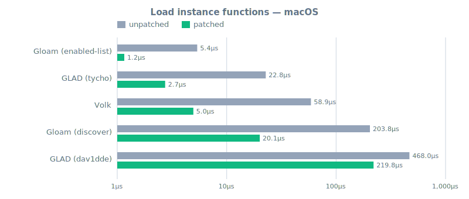
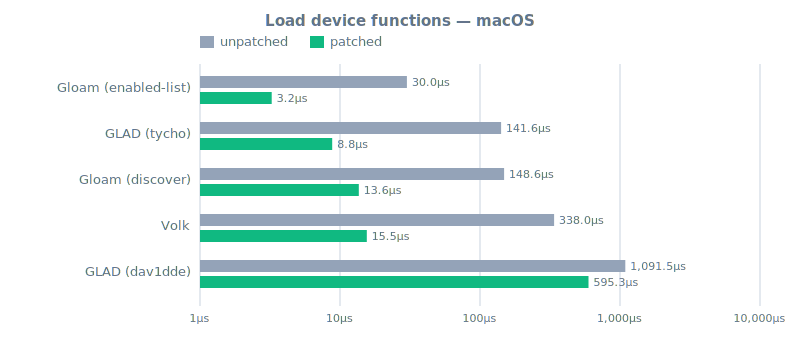
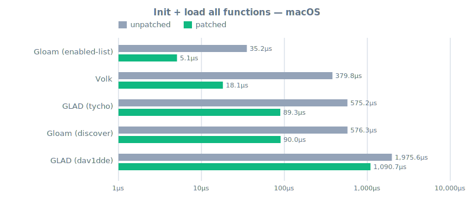
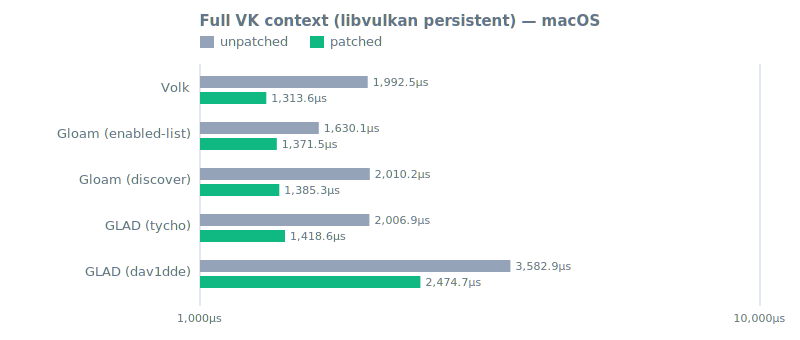
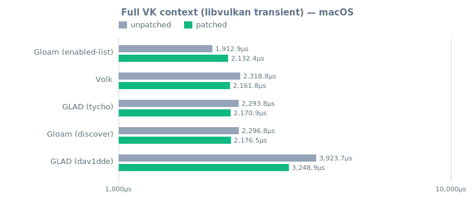

# macOS report

_This file is generated by `make render` from `reports/macos/*.json`.
Do not edit by hand - edits will be overwritten on the next render._

> **How to read this.** These numbers measure function-pointer loading overhead
> and Vulkan context setup across different API loaders, comparing the stock
> Vulkan loader against the patched one (see the README for what the patch
> does). **Lower is better.**
>
> **Do not compare across hosts.** Hardware, drivers, OS, and compiler flags
> all differ between the Linux, MinGW, and macOS reports. The meaningful
> comparisons are *within* a single report: loader vs. loader and patched vs.
> unpatched on the same hardware.


## At a glance

Lower is better. **Winner** = best patched average on this host for each task.

| Task                                   | Winner                   | Patched avg | Unpatched avg | Patch speedup |
|----------------------------------------|--------------------------|------------:|--------------:|--------------:|
| Load instance functions                | **Gloam (enabled-list)** |      1.16µs |        5.38µs |          4.6× |
| Load device functions                  | **Gloam (enabled-list)** |      3.25µs |       30.04µs |          9.2× |
| Init + load all functions              | **Gloam (enabled-list)** |      5.07µs |       35.23µs |          6.9× |
| Full VK context (libvulkan persistent) | **Volk**                 |   1313.57µs |     1992.53µs |          1.5× |
| Full VK context (libvulkan transient)  | **Gloam (enabled-list)** |   2132.43µs |     1912.87µs |          0.9× |


## Task detail

### Load instance functions

| Loader                   | Unpatched |  Patched | Patch speedup | vs. fastest |
|--------------------------|----------:|---------:|--------------:|------------:|
| **Gloam (enabled-list)** |    5.38µs |   1.16µs |          4.6× |        1.0× |
| GLAD (tycho)             |   22.76µs |   2.74µs |          8.3× |        2.4× |
| Volk                     |   58.89µs |   4.96µs |         11.9× |        4.3× |
| Gloam (discover)         |  203.75µs |  20.06µs |         10.2× |       17.3× |
| GLAD (dav1dde)           |  468.01µs | 219.82µs |          2.1× |        190× |




### Load device functions

| Loader                   | Unpatched |  Patched | Patch speedup | vs. fastest |
|--------------------------|----------:|---------:|--------------:|------------:|
| **Gloam (enabled-list)** |   30.04µs |   3.25µs |          9.2× |        1.0× |
| GLAD (tycho)             |  141.58µs |   8.80µs |         16.1× |        2.7× |
| Gloam (discover)         |  148.56µs |  13.63µs |         10.9× |        4.2× |
| Volk                     |  338.01µs |  15.54µs |         21.8× |        4.8× |
| GLAD (dav1dde)           | 1091.54µs | 595.26µs |          1.8× |        183× |




### Init + load all functions

| Loader                   | Unpatched |   Patched | Patch speedup | vs. fastest |
|--------------------------|----------:|----------:|--------------:|------------:|
| **Gloam (enabled-list)** |   35.23µs |    5.07µs |          6.9× |        1.0× |
| Volk                     |  379.83µs |   18.13µs |         21.0× |        3.6× |
| GLAD (tycho)             |  575.17µs |   89.30µs |          6.4× |       17.6× |
| Gloam (discover)         |  576.33µs |   90.00µs |          6.4× |       17.8× |
| GLAD (dav1dde)           | 1975.60µs | 1090.70µs |          1.8× |        215× |




### Full VK context (libvulkan persistent)

| Loader               | Unpatched |   Patched | Patch speedup | vs. fastest |
|----------------------|----------:|----------:|--------------:|------------:|
| **Volk**             | 1992.53µs | 1313.57µs |          1.5× |        1.0× |
| Gloam (enabled-list) | 1630.13µs | 1371.50µs |          1.2× |        1.0× |
| Gloam (discover)     | 2010.17µs | 1385.27µs |          1.5× |        1.1× |
| GLAD (tycho)         | 2006.93µs | 1418.60µs |          1.4× |        1.1× |
| GLAD (dav1dde)       | 3582.93µs | 2474.70µs |          1.4× |        1.9× |




### Full VK context (libvulkan transient)

| Loader                   | Unpatched |   Patched | Patch speedup | vs. fastest |
|--------------------------|----------:|----------:|--------------:|------------:|
| **Gloam (enabled-list)** | 1912.87µs | 2132.43µs |          0.9× |        1.0× |
| Volk                     | 2318.80µs | 2161.77µs |          1.1× |        1.0× |
| GLAD (tycho)             | 2293.83µs | 2170.93µs |          1.1× |        1.0× |
| Gloam (discover)         | 2296.83µs | 2176.47µs |          1.1× |        1.0× |
| GLAD (dav1dde)           | 3923.67µs | 3248.93µs |          1.2× |        1.5× |




## Binary sizes

All sizes in bytes. Sorted by stripped binary size. Section values come from `size`; Mach-O binaries report BSS as zero because the Mach-O segment model folds zero-init into `__DATA`.

| Loader               | Loader .o |  Binary |    text |   data | bss |
|----------------------|----------:|--------:|--------:|-------:|----:|
| GLAD (tycho)         |    74,024 |  70,608 |  49,152 | 16,384 |   0 |
| Gloam (discover)     |    47,912 |  87,360 |  65,536 | 16,384 |   0 |
| Gloam (enabled-list) |    47,912 |  87,360 |  65,536 | 16,384 |   0 |
| Volk                 |   259,216 | 136,312 | 114,688 | 16,384 |   0 |
| GLAD (dav1dde)       |   275,592 | 161,856 | 114,688 | 16,384 |   0 |


<details>
<summary>Test host details</summary>

### Host

| Field        | Value         |
|--------------|---------------|
| OS           | Darwin 25.4.0 |
| Architecture | arm64         |
| CPU          | Apple M5      |


### Toolchain

| Field    | Value                                    |
|----------|------------------------------------------|
| CC       | clang (21.0.0)                           |
| CXX      | clang++ (21.0.0)                         |
| OPTFLAGS | `-O2 -fno-unroll-loops -mcpu=native -g0` |
| CFLAGS   | `-std=c17`                               |
| CXXFLAGS | `-std=c++20`                             |


### Project versions

| Project        | Version                 |
|----------------|-------------------------|
| GLAD (dav1dde) | `2.0.8-8-ga4ca574`      |
| GLAD (tycho)   | `2.0.8-91-g8092eae`     |
| gloam          | `0.4.8-1-gac4fa45`      |
| Volk           | `1.4.341.0-26-gd41d1af` |
| xxHash         | `0.7.4-1019-ge573d4d`   |
| Vulkan-Headers | `1.4.349`               |


### vulkaninfo

```
Devices:
========
GPU0:
	apiVersion         = 1.4.334
	driverVersion      = 0.2.2209
	vendorID           = 0x106b
	deviceID           = 0x1a04020a
	deviceType         = PHYSICAL_DEVICE_TYPE_INTEGRATED_GPU
	deviceName         = Apple M5
	driverID           = DRIVER_ID_MOLTENVK
	driverName         = MoltenVK
	driverInfo         = 1.4.1
	conformanceVersion = 1.4.4.0
	deviceUUID         = 0000106b-1a04-020a-0000-000000000000
	driverUUID         = 4d564b00-0000-28a1-1a04-020a00000000
```

</details>
