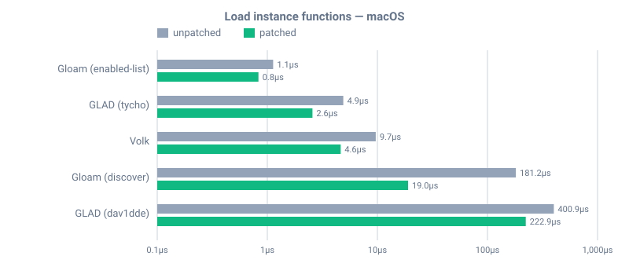
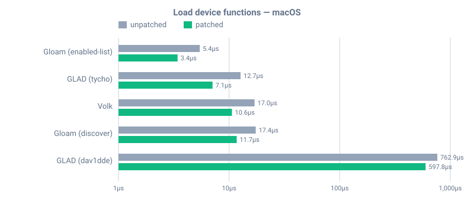
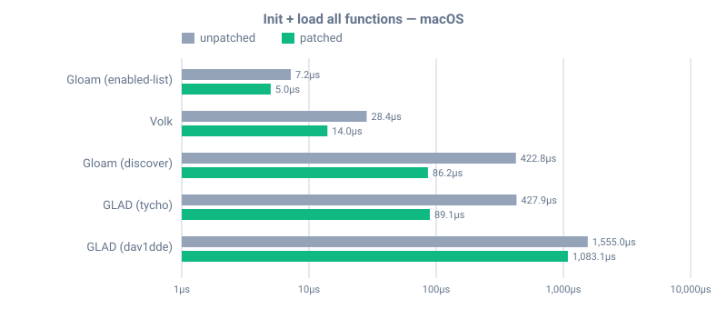
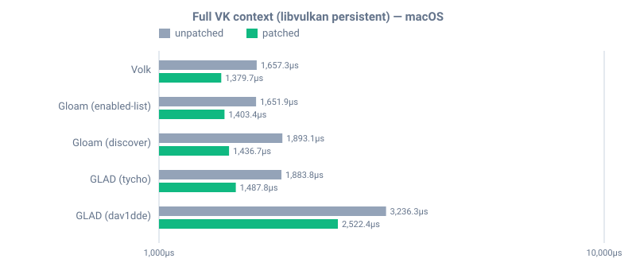
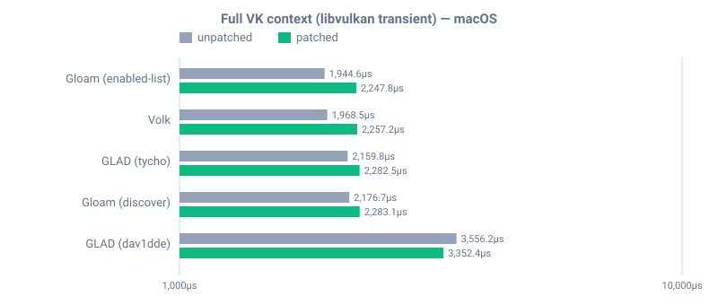

# macOS report

_This file is generated by `make render` from `reports/macos/*.json`.
Do not edit by hand - edits will be overwritten on the next render._

> **How to read this.** These numbers measure function-pointer loading overhead
> and Vulkan context setup across different API loaders, comparing the stock
> Vulkan loader against the patched one (see the README for what the patch
> does). **Lower is better.**
>
> **Do not compare across hosts.** Hardware, drivers, OS, and compiler flags
> all differ between the Linux, MinGW, and macOS reports. The meaningful
> comparisons are *within* a single report: loader vs. loader and patched vs.
> unpatched on the same hardware.


## At a glance

Lower is better. **Winner** = best patched average on this host for each task.

| Task                                   | Winner                   | Patched avg | Unpatched avg | Patch speedup |
|----------------------------------------|--------------------------|------------:|--------------:|--------------:|
| Load instance functions                | **Gloam (enabled-list)** |      0.83µs |        1.13µs |          1.4× |
| Load device functions                  | **Gloam (enabled-list)** |      3.42µs |        5.43µs |          1.6× |
| Init + load all functions              | **Gloam (enabled-list)** |      5.00µs |        7.20µs |          1.4× |
| Full VK context (libvulkan persistent) | **Volk**                 |   1379.73µs |     1657.27µs |          1.2× |
| Full VK context (libvulkan transient)  | **Gloam (enabled-list)** |   2247.83µs |     1944.57µs |          0.9× |


## Task detail

### Load instance functions

| Loader                   | Unpatched |  Patched | Patch speedup | vs. fastest |
|--------------------------|----------:|---------:|--------------:|------------:|
| **Gloam (enabled-list)** |    1.13µs |   0.83µs |          1.4× |        1.0× |
| GLAD (tycho)             |    4.90µs |   2.57µs |          1.9× |        3.1× |
| Volk                     |    9.66µs |   4.64µs |          2.1× |        5.6× |
| Gloam (discover)         |  181.21µs |  19.00µs |          9.5× |       22.9× |
| GLAD (dav1dde)           |  400.87µs | 222.95µs |          1.8× |        269× |




### Load device functions

| Loader                   | Unpatched |  Patched | Patch speedup | vs. fastest |
|--------------------------|----------:|---------:|--------------:|------------:|
| **Gloam (enabled-list)** |    5.43µs |   3.42µs |          1.6× |        1.0× |
| GLAD (tycho)             |   12.69µs |   7.08µs |          1.8× |        2.1× |
| Volk                     |   16.99µs |  10.62µs |          1.6× |        3.1× |
| Gloam (discover)         |   17.41µs |  11.72µs |          1.5× |        3.4× |
| GLAD (dav1dde)           |  762.92µs | 597.76µs |          1.3× |        175× |




### Init + load all functions

| Loader                   | Unpatched |   Patched | Patch speedup | vs. fastest |
|--------------------------|----------:|----------:|--------------:|------------:|
| **Gloam (enabled-list)** |    7.20µs |    5.00µs |          1.4× |        1.0× |
| Volk                     |   28.40µs |   13.97µs |          2.0× |        2.8× |
| Gloam (discover)         |  422.80µs |   86.17µs |          4.9× |       17.2× |
| GLAD (tycho)             |  427.90µs |   89.13µs |          4.8× |       17.8× |
| GLAD (dav1dde)           | 1555.03µs | 1083.13µs |          1.4× |        217× |




### Full VK context (libvulkan persistent)

| Loader               | Unpatched |   Patched | Patch speedup | vs. fastest |
|----------------------|----------:|----------:|--------------:|------------:|
| **Volk**             | 1657.27µs | 1379.73µs |          1.2× |        1.0× |
| Gloam (enabled-list) | 1651.93µs | 1403.43µs |          1.2× |        1.0× |
| Gloam (discover)     | 1893.13µs | 1436.73µs |          1.3× |        1.0× |
| GLAD (tycho)         | 1883.83µs | 1487.80µs |          1.3× |        1.1× |
| GLAD (dav1dde)       | 3236.33µs | 2522.37µs |          1.3× |        1.8× |




### Full VK context (libvulkan transient)

| Loader                   | Unpatched |   Patched | Patch speedup | vs. fastest |
|--------------------------|----------:|----------:|--------------:|------------:|
| **Gloam (enabled-list)** | 1944.57µs | 2247.83µs |          0.9× |        1.0× |
| Volk                     | 1968.47µs | 2257.23µs |          0.9× |        1.0× |
| GLAD (tycho)             | 2159.80µs | 2282.53µs |          0.9× |        1.0× |
| Gloam (discover)         | 2176.73µs | 2283.10µs |          1.0× |        1.0× |
| GLAD (dav1dde)           | 3556.23µs | 3352.43µs |          1.1× |        1.5× |




## Binary sizes

All sizes in bytes. Sorted by stripped binary size. Section values come from `size`; Mach-O binaries report BSS as zero because the Mach-O segment model folds zero-init into `__DATA`.

| Loader               | Loader .o |  Binary |    text |   data | bss |
|----------------------|----------:|--------:|--------:|-------:|----:|
| GLAD (tycho)         |    74,024 |  70,608 |  49,152 | 16,384 |   0 |
| Gloam (discover)     |    54,320 |  87,568 |  65,536 | 16,384 |   0 |
| Gloam (enabled-list) |    54,320 |  87,568 |  65,536 | 16,384 |   0 |
| Volk                 |   265,936 | 136,312 | 114,688 | 16,384 |   0 |
| GLAD (dav1dde)       |   275,592 | 161,856 | 114,688 | 16,384 |   0 |


<details>
<summary>Test host details</summary>

### Host

| Field        | Value         |
|--------------|---------------|
| OS           | Darwin 25.6.0 |
| Architecture | arm64         |
| CPU          | Apple M5      |


### Toolchain

| Field    | Value                                    |
|----------|------------------------------------------|
| CC       | clang (21.0.0)                           |
| CXX      | clang++ (21.0.0)                         |
| OPTFLAGS | `-O2 -fno-unroll-loops -mcpu=native -g0` |
| CFLAGS   | `-std=c17`                               |
| CXXFLAGS | `-std=c++20`                             |


### Project versions

| Project        | Version                |
|----------------|------------------------|
| GLAD (dav1dde) | `2.0.8-10-ge3c14f9`    |
| GLAD (tycho)   | `2.0.8-92-g1002eae`    |
| gloam          | `0.7.0`                |
| Volk           | `1.4.357.0-7-g2e19a77` |
| xxHash         | `0.7.4-1023-gc0b5ea9`  |
| Vulkan-Headers | `1.4.360`              |


### vulkaninfo

```
Devices:
========
GPU0:
	apiVersion         = 1.4.357
	driverVersion      = 0.2.2210
	vendorID           = 0x106b
	deviceID           = 0x1a06020a
	deviceType         = PHYSICAL_DEVICE_TYPE_INTEGRATED_GPU
	deviceName         = Apple M5
	driverID           = DRIVER_ID_MOLTENVK
	driverName         = MoltenVK
	driverInfo         = 1.4.2
	conformanceVersion = 1.4.4.0
	deviceUUID         = 0000106b-1a06-020a-0000-000000000000
	driverUUID         = 4d564b00-0000-28a2-1a06-020a00000000
```

</details>
