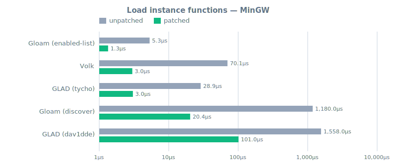
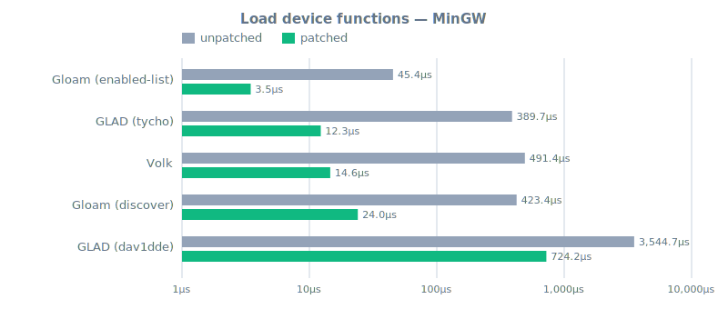
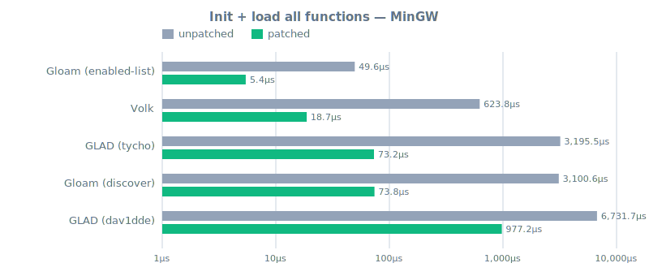
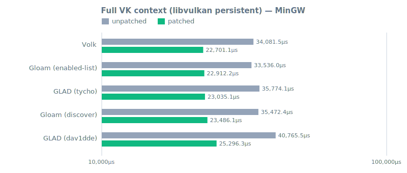
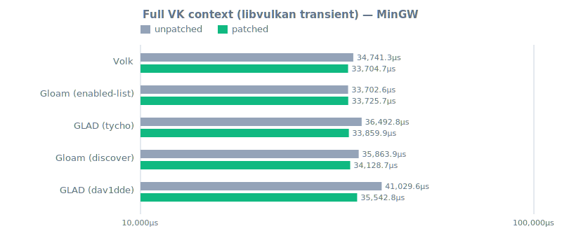

# MinGW report

_This file is generated by `make render` from `reports/mingw/*.json`.
Do not edit by hand - edits will be overwritten on the next render._

> **How to read this.** These numbers measure function-pointer loading overhead
> and Vulkan context setup across different API loaders, comparing the stock
> Vulkan loader against the patched one (see the README for what the patch
> does). **Lower is better.**
>
> **Do not compare across hosts.** Hardware, drivers, OS, and compiler flags
> all differ between the Linux, MinGW, and macOS reports. The meaningful
> comparisons are *within* a single report: loader vs. loader and patched vs.
> unpatched on the same hardware.


## At a glance

Lower is better. **Winner** = best patched average on this host for each task.

| Task                                   | Winner                   | Patched avg | Unpatched avg | Patch speedup |
|----------------------------------------|--------------------------|------------:|--------------:|--------------:|
| Load instance functions                | **Gloam (enabled-list)** |      1.34µs |        5.31µs |          4.0× |
| Load device functions                  | **Gloam (enabled-list)** |      3.46µs |       45.36µs |         13.1× |
| Init + load all functions              | **Gloam (enabled-list)** |      5.43µs |       49.57µs |          9.1× |
| Full VK context (libvulkan persistent) | **Volk**                 |  22701.10µs |    34081.53µs |          1.5× |
| Full VK context (libvulkan transient)  | **Volk**                 |  33704.73µs |    34741.27µs |          1.0× |


## Task detail

### Load instance functions

| Loader                   | Unpatched |  Patched | Patch speedup | vs. fastest |
|--------------------------|----------:|---------:|--------------:|------------:|
| **Gloam (enabled-list)** |    5.31µs |   1.34µs |          4.0× |        1.0× |
| Volk                     |   70.13µs |   2.99µs |         23.5× |        2.2× |
| GLAD (tycho)             |   28.85µs |   3.05µs |          9.5× |        2.3× |
| Gloam (discover)         | 1179.97µs |  20.36µs |         58.0× |       15.2× |
| GLAD (dav1dde)           | 1558.04µs | 100.98µs |         15.4× |       75.4× |




### Load device functions

| Loader                   | Unpatched |  Patched | Patch speedup | vs. fastest |
|--------------------------|----------:|---------:|--------------:|------------:|
| **Gloam (enabled-list)** |   45.36µs |   3.46µs |         13.1× |        1.0× |
| GLAD (tycho)             |  389.72µs |  12.28µs |         31.7× |        3.5× |
| Volk                     |  491.41µs |  14.57µs |         33.7× |        4.2× |
| Gloam (discover)         |  423.43µs |  23.99µs |         17.7× |        6.9× |
| GLAD (dav1dde)           | 3544.73µs | 724.25µs |          4.9× |        209× |




### Init + load all functions

| Loader                   | Unpatched |  Patched | Patch speedup | vs. fastest |
|--------------------------|----------:|---------:|--------------:|------------:|
| **Gloam (enabled-list)** |   49.57µs |   5.43µs |          9.1× |        1.0× |
| Volk                     |  623.83µs |  18.70µs |         33.4× |        3.4× |
| GLAD (tycho)             | 3195.53µs |  73.17µs |         43.7× |       13.5× |
| Gloam (discover)         | 3100.57µs |  73.83µs |         42.0× |       13.6× |
| GLAD (dav1dde)           | 6731.70µs | 977.23µs |          6.9× |        180× |




### Full VK context (libvulkan persistent)

| Loader               |  Unpatched |    Patched | Patch speedup | vs. fastest |
|----------------------|-----------:|-----------:|--------------:|------------:|
| **Volk**             | 34081.53µs | 22701.10µs |          1.5× |        1.0× |
| Gloam (enabled-list) | 33536.03µs | 22912.20µs |          1.5× |        1.0× |
| GLAD (tycho)         | 35774.10µs | 23035.10µs |          1.6× |        1.0× |
| Gloam (discover)     | 35472.43µs | 23486.10µs |          1.5× |        1.0× |
| GLAD (dav1dde)       | 40765.50µs | 25296.33µs |          1.6× |        1.1× |




### Full VK context (libvulkan transient)

| Loader               |  Unpatched |    Patched | Patch speedup | vs. fastest |
|----------------------|-----------:|-----------:|--------------:|------------:|
| **Volk**             | 34741.27µs | 33704.73µs |          1.0× |        1.0× |
| Gloam (enabled-list) | 33702.63µs | 33725.73µs |          1.0× |        1.0× |
| GLAD (tycho)         | 36492.77µs | 33859.93µs |          1.1× |        1.0× |
| Gloam (discover)     | 35863.90µs | 34128.70µs |          1.1× |        1.0× |
| GLAD (dav1dde)       | 41029.63µs | 35542.80µs |          1.2× |        1.1× |




## Binary sizes

All sizes in bytes. Sorted by stripped binary size. Section values come from `size`; Mach-O binaries report BSS as zero because the Mach-O segment model folds zero-init into `__DATA`.

| Loader               | Loader .o |  Binary |   text |   data | bss |
|----------------------|----------:|--------:|-------:|-------:|----:|
| Gloam (discover)     |    46,745 |  69,120 | 22,742 | 43,508 |   0 |
| Gloam (enabled-list) |    46,745 |  70,144 | 23,782 | 43,604 |   0 |
| GLAD (tycho)         |    53,072 |  70,656 | 19,574 | 48,220 |   0 |
| Volk                 |   223,294 | 110,592 | 75,830 | 31,532 |   0 |
| GLAD (dav1dde)       |   192,597 | 120,320 | 76,006 | 41,372 |   0 |


<details>
<summary>Test host details</summary>

### Host

| Field        | Value                                       |
|--------------|---------------------------------------------|
| OS           | MINGW64_NT-10.0-26200 3.6.7-f2802c5f.x86_64 |
| Architecture | x86_64                                      |
| CPU          | AMD RYZEN AI MAX+ PRO 395 w/ Radeon 8060S   |


### Toolchain

| Field    | Value                                                      |
|----------|------------------------------------------------------------|
| CC       | clang (22.1.3)                                             |
| CXX      | clang++ (22.1.3)                                           |
| OPTFLAGS | `-O2 -fno-unroll-loops -march=x86-64-v2 -mtune=znver3 -g0` |
| CFLAGS   | `-std=c17`                                                 |
| CXXFLAGS | `-std=c++20`                                               |


### Project versions

| Project        | Version                 |
|----------------|-------------------------|
| GLAD (dav1dde) | `2.0.8-8-ga4ca574`      |
| GLAD (tycho)   | `2.0.8-91-g8092eae`     |
| gloam          | `0.4.8-1-gac4fa45`      |
| Volk           | `1.4.341.0-26-gd41d1af` |
| xxHash         | `0.7.4-1019-ge573d4d`   |
| Vulkan-Headers | `1.4.349`               |


### vulkaninfo

```
Devices:
========
GPU0:
	apiVersion         = 1.4.344
	driverVersion      = 2.0.388
	vendorID           = 0x1002
	deviceID           = 0x1586
	deviceType         = PHYSICAL_DEVICE_TYPE_INTEGRATED_GPU
	deviceName         = AMD Radeon(TM) 8060S Graphics
	driverID           = DRIVER_ID_AMD_PROPRIETARY
	driverName         = AMD proprietary driver
	driverInfo         = 26.5.1 (LLPC)
	conformanceVersion = 1.4.3.3
	deviceUUID         = 00000000-c300-0000-0000-000000000000
	driverUUID         = 414d442d-5749-4e2d-4452-560000000000
```

</details>
