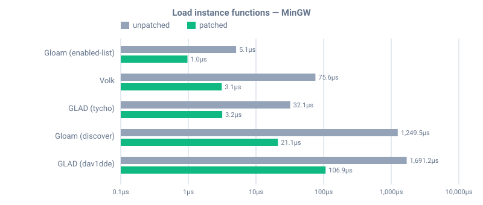
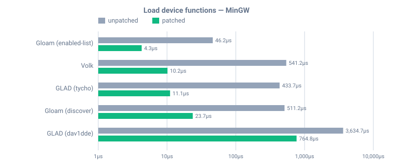
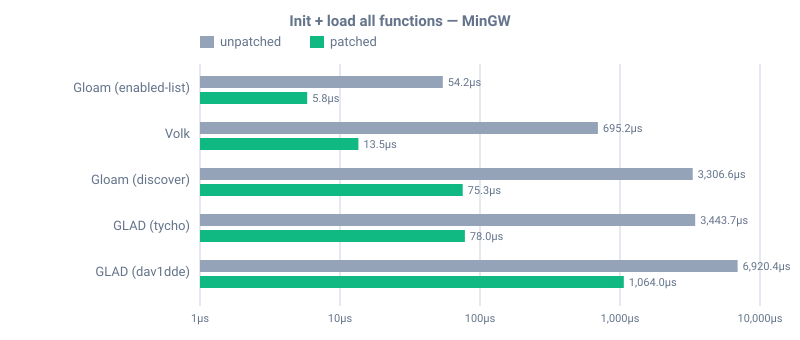
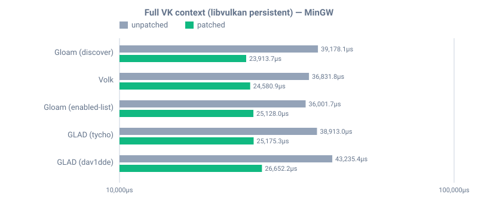
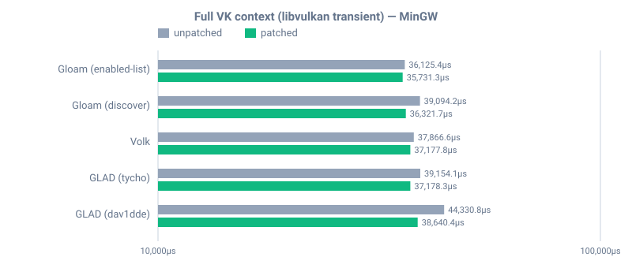

# MinGW report

_This file is generated by `make render` from `reports/mingw/*.json`.
Do not edit by hand - edits will be overwritten on the next render._

> **How to read this.** These numbers measure function-pointer loading overhead
> and Vulkan context setup across different API loaders, comparing the stock
> Vulkan loader against the patched one (see the README for what the patch
> does). **Lower is better.**
>
> **Do not compare across hosts.** Hardware, drivers, OS, and compiler flags
> all differ between the Linux, MinGW, and macOS reports. The meaningful
> comparisons are *within* a single report: loader vs. loader and patched vs.
> unpatched on the same hardware.


## At a glance

Lower is better. **Winner** = best patched average on this host for each task.

| Task                                   | Winner                   | Patched avg | Unpatched avg | Patch speedup |
|----------------------------------------|--------------------------|------------:|--------------:|--------------:|
| Load instance functions                | **Gloam (enabled-list)** |      0.97µs |        5.08µs |          5.2× |
| Load device functions                  | **Gloam (enabled-list)** |      4.28µs |       46.21µs |         10.8× |
| Init + load all functions              | **Gloam (enabled-list)** |      5.83µs |       54.20µs |          9.3× |
| Full VK context (libvulkan persistent) | **Gloam (discover)**     |  23913.73µs |    39178.07µs |          1.6× |
| Full VK context (libvulkan transient)  | **Gloam (enabled-list)** |  35731.30µs |    36125.40µs |          1.0× |


## Task detail

### Load instance functions

| Loader                   | Unpatched |  Patched | Patch speedup | vs. fastest |
|--------------------------|----------:|---------:|--------------:|------------:|
| **Gloam (enabled-list)** |    5.08µs |   0.97µs |          5.2× |        1.0× |
| Volk                     |   75.59µs |   3.12µs |         24.2× |        3.2× |
| GLAD (tycho)             |   32.11µs |   3.17µs |         10.1× |        3.3× |
| Gloam (discover)         | 1249.52µs |  21.08µs |         59.3× |       21.7× |
| GLAD (dav1dde)           | 1691.24µs | 106.91µs |         15.8× |        110× |




### Load device functions

| Loader                   | Unpatched |  Patched | Patch speedup | vs. fastest |
|--------------------------|----------:|---------:|--------------:|------------:|
| **Gloam (enabled-list)** |   46.21µs |   4.28µs |         10.8× |        1.0× |
| Volk                     |  541.21µs |  10.15µs |         53.3× |        2.4× |
| GLAD (tycho)             |  433.67µs |  11.07µs |         39.2× |        2.6× |
| Gloam (discover)         |  511.23µs |  23.67µs |         21.6× |        5.5× |
| GLAD (dav1dde)           | 3634.71µs | 764.79µs |          4.8× |        179× |




### Init + load all functions

| Loader                   | Unpatched |   Patched | Patch speedup | vs. fastest |
|--------------------------|----------:|----------:|--------------:|------------:|
| **Gloam (enabled-list)** |   54.20µs |    5.83µs |          9.3× |        1.0× |
| Volk                     |  695.20µs |   13.53µs |         51.4× |        2.3× |
| Gloam (discover)         | 3306.63µs |   75.27µs |         43.9× |       12.9× |
| GLAD (tycho)             | 3443.70µs |   78.00µs |         44.1× |       13.4× |
| GLAD (dav1dde)           | 6920.37µs | 1063.97µs |          6.5× |        182× |




### Full VK context (libvulkan persistent)

| Loader               |  Unpatched |    Patched | Patch speedup | vs. fastest |
|----------------------|-----------:|-----------:|--------------:|------------:|
| **Gloam (discover)** | 39178.07µs | 23913.73µs |          1.6× |        1.0× |
| Volk                 | 36831.83µs | 24580.90µs |          1.5× |        1.0× |
| Gloam (enabled-list) | 36001.67µs | 25128.03µs |          1.4× |        1.1× |
| GLAD (tycho)         | 38912.97µs | 25175.33µs |          1.5× |        1.1× |
| GLAD (dav1dde)       | 43235.43µs | 26652.23µs |          1.6× |        1.1× |




### Full VK context (libvulkan transient)

| Loader                   |  Unpatched |    Patched | Patch speedup | vs. fastest |
|--------------------------|-----------:|-----------:|--------------:|------------:|
| **Gloam (enabled-list)** | 36125.40µs | 35731.30µs |          1.0× |        1.0× |
| Gloam (discover)         | 39094.23µs | 36321.73µs |          1.1× |        1.0× |
| Volk                     | 37866.63µs | 37177.77µs |          1.0× |        1.0× |
| GLAD (tycho)             | 39154.10µs | 37178.27µs |          1.1× |        1.0× |
| GLAD (dav1dde)           | 44330.80µs | 38640.37µs |          1.1× |        1.1× |




## Binary sizes

All sizes in bytes. Sorted by stripped binary size. Section values come from `size`; Mach-O binaries report BSS as zero because the Mach-O segment model folds zero-init into `__DATA`.

| Loader               | Loader .o |  Binary |   text |   data | bss |
|----------------------|----------:|--------:|-------:|-------:|----:|
| GLAD (tycho)         |    53,072 |  67,072 | 17,366 | 47,404 |   0 |
| Gloam (discover)     |    53,163 |  70,144 | 23,286 | 44,820 |   0 |
| Gloam (enabled-list) |    53,163 |  71,168 | 24,326 | 44,916 |   0 |
| Volk                 |   229,029 | 108,032 | 75,206 | 31,224 |   0 |
| GLAD (dav1dde)       |   192,597 | 116,736 | 73,798 | 40,588 |   0 |


<details>
<summary>Test host details</summary>

### Host

| Field        | Value                                        |
|--------------|----------------------------------------------|
| OS           | MINGW64_NT-10.0-26200 3.6.10-8fbd9808.x86_64 |
| Architecture | x86_64                                       |
| CPU          | AMD RYZEN AI MAX+ PRO 395 w/ Radeon 8060S    |


### Toolchain

| Field    | Value                                                      |
|----------|------------------------------------------------------------|
| CC       | clang (22.1.8)                                             |
| CXX      | clang++ (22.1.8)                                           |
| OPTFLAGS | `-O2 -fno-unroll-loops -march=x86-64-v2 -mtune=znver3 -g0` |
| CFLAGS   | `-std=c17`                                                 |
| CXXFLAGS | `-std=c++20`                                               |


### Project versions

| Project        | Version                |
|----------------|------------------------|
| GLAD (dav1dde) | `2.0.8-10-ge3c14f9`    |
| GLAD (tycho)   | `2.0.8-92-g1002eae`    |
| gloam          | `0.7.0`                |
| Volk           | `1.4.357.0-7-g2e19a77` |
| xxHash         | `0.7.4-1023-gc0b5ea9`  |
| Vulkan-Headers | `1.4.360`              |


### vulkaninfo

```
Devices:
========
GPU0:
	apiVersion         = 1.4.349
	driverVersion      = 2.0.395
	vendorID           = 0x1002
	deviceID           = 0x1586
	deviceType         = PHYSICAL_DEVICE_TYPE_INTEGRATED_GPU
	deviceName         = AMD Radeon(TM) 8060S Graphics
	driverID           = DRIVER_ID_AMD_PROPRIETARY
	driverName         = AMD proprietary driver
	driverInfo         = 26.7.1 (LLPC)
	conformanceVersion = 1.4.3.3
	deviceUUID         = 00000000-c300-0000-0000-000000000000
	driverUUID         = 414d442d-5749-4e2d-4452-560000000000
```

</details>
